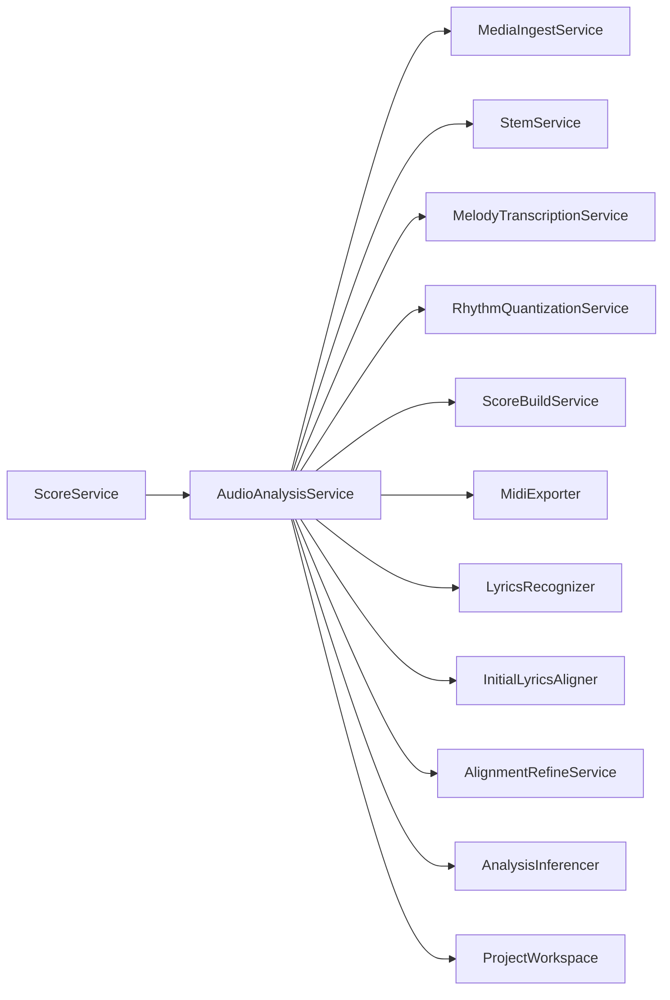
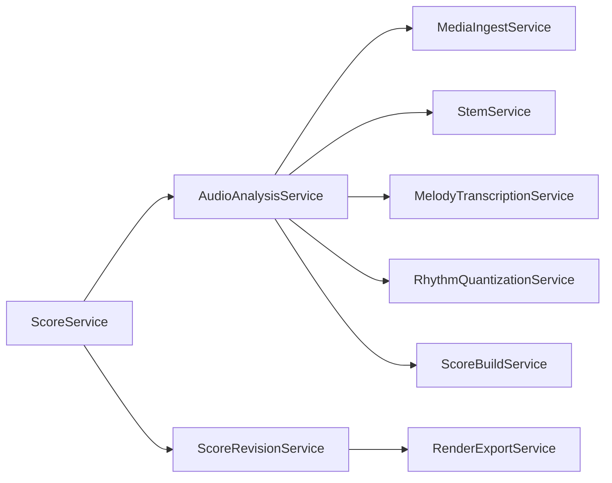
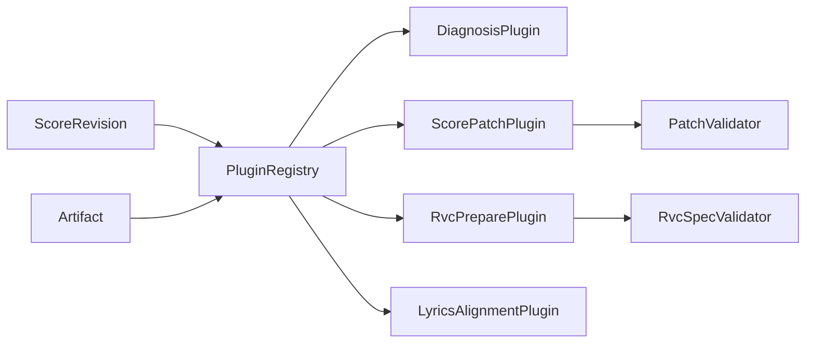

# SunoScribe Mainline And Plugin Architecture

## Purpose

This document defines the slim production mainline for the lead-vocal MVP and the first lightweight internal plugin boundary. The goal is to keep audio-to-score deterministic, narrow, and traceable, while moving optional diagnosis/edit/RVC/lyrics behavior behind post-`ScoreRevision` plugins.

## Trunk Services

The production mainline has exactly these six trunk stage services:

1. `MediaIngestService`: source media to canonical WAV.
2. `StemService`: canonical WAV to typed vocal/accompaniment stems.
3. `MelodyTranscriptionService`: vocals stem to F0, note candidates, selected melody, and quantized notes.
4. `RhythmQuantizationService`: transcription semantic output to `RhythmGrid` payload.
5. `ScoreBuildService`: stable transcription output and rhythm context to `ScoreIR` and export-facing `score_data`.
6. `RenderExportService`: selected `ScoreRevision` to MIDI, MusicXML, and score view artifacts.

`AudioAnalysisService` is not a stage owner. It is the orchestrator that creates the project workspace, calls the trunk stages in order, aggregates typed results, and stops on required-stage failure.

## Current Dependency Shape

Before slimming, `AudioAnalysisService` was the broadest object in the pipeline:

The problem with this shape is not the number of helpers by itself. The problem is that optional lyrics, alignment refinement, diagnostics, and compatibility export concerns can appear to be part of the required production happy path.

## Target Mainline Shape

The target mainline is deliberately narrow:

Required-stage rules:

- Missing media ingest, vocal separation, pitch pipeline, pitch notes, ScoreIR build, or score data build fails the task.
- Required failures must not create fallback `ScoreIR` as a successful machine transcription.
- Optional lyrics/alignment/diagnosis/RVC work must not be needed to create the machine `ScoreRevision`.

## Plugin Shape

Plugins run after `ScoreRevision` and typed artifacts exist:

The first registry is intentionally simple:

- In-process Python registry only.
- Built-in plugins only; no directory scan or third-party dynamic loading.
- Plugin input is read-only `PluginContext` containing `ScoreRevision`, artifact refs, optional JSON artifacts, warnings, and call params.
- Plugin output is `PluginResult`; callers decide whether to validate/apply the returned payload.
- Plugins must not directly mutate database rows or write final exports.

## Built-In Plugin Roles

- `diagnosis`: reads revision context and typed artifacts; returns transcription diagnosis.
- `score_patch_agent`: proposes a controlled patch; caller validates before creating a user revision.
- `rvc_prepare`: prepares an RVC job spec; caller validates before enqueueing external work.
- `lyrics_alignment`: reserved optional plugin for future lyrics recognition/alignment, currently not part of the mainline.

## Review Checklist

Before adding new behavior, decide whether it is trunk or plugin:

- If score generation cannot be correct without it, it may belong to a trunk service.
- If it explains, edits, converts, renders an alternate view, or calls an external workflow, it belongs behind the plugin boundary.
- If it can fail without invalidating the machine `ScoreRevision`, it must not be required by `AudioAnalysisService`.
